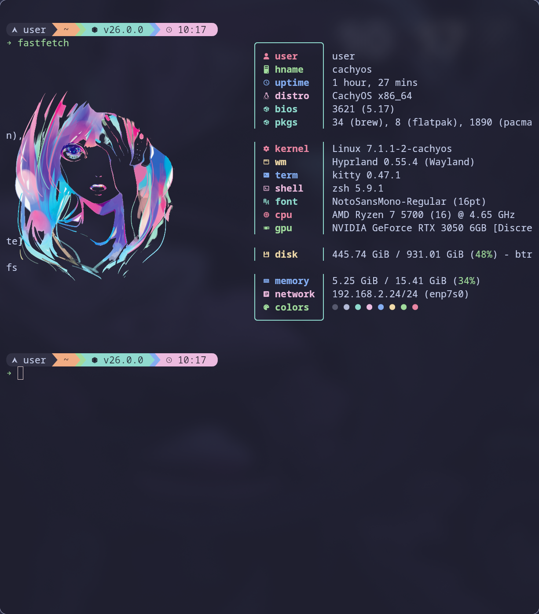
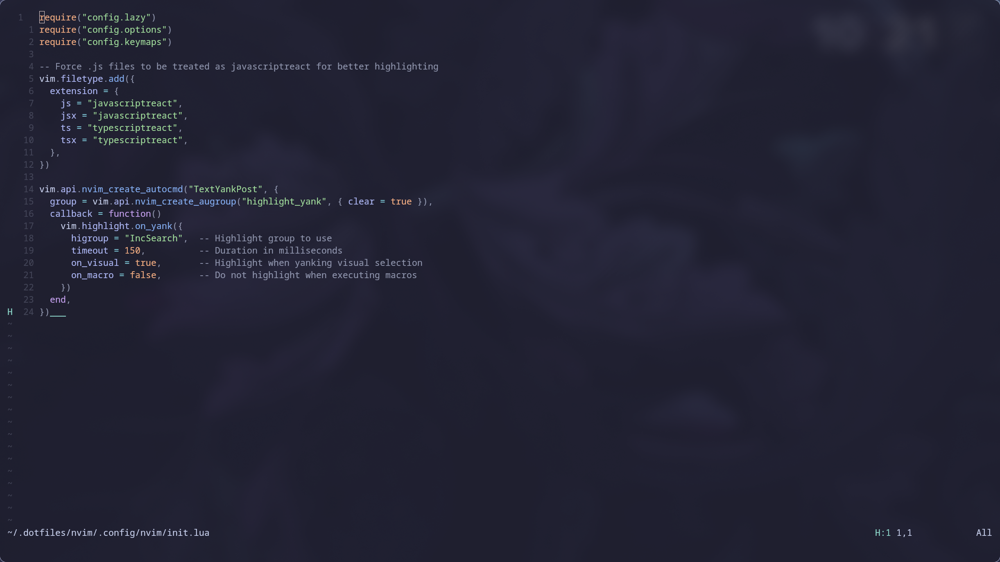

# Dotfiles

Personal configuration files and environment settings for Linux. 

## Contents
- [Overview](#overview)
- [Screenshots](#screenshots)
- [Managed Applications](#managed-applications)
- [Dependencies](#dependencies)
- [Installation](#installation)
- [Script Options](#script-options)
- [Theme Switcher](#theme-switcher)
- [How it Works](#how-it-works)
- [Troubleshooting](#troubleshooting)
- [Adding New Configs](#adding-new-configs)

## Overview

This repository uses a modular structure where each directory represents an application or tool. A central setup script manages the creation of symbolic links from the repository to your home directory and `~/.config` folder. It alse uses the [caelestia shell](https://github.com/caelestia-dots/caelestia) with hyprland which you can install by yourself.

## Screenshots

<ul align="center">
  <li><h3>Fastfetch</h3></li>
  <li><h3>NeoVim</h3></li>
</ul>

> [!TIP]
> Checkout my wallpapers on [GermanViter/wallpapers](https://github.com/GermanViter/wallpapers).

## Managed Applications

- **Terminal/Shell**: [Zsh](https://www.zsh.org/)
- **Editors**: [Neovim](https://neovim.io/) (LazyVim)
- **Prompt**: [Starship](https://starship.rs/)
- **UI/Window Management**: [Kitty](https://sw.kovidgoyal.net/kitty/)
- **CLI Tools**: [Fastfetch](https://github.com/fastfetch-cli/fastfetch), [Bat](https://github.com/sharkdp/bat) 

## Local Overrides

To add private configurations (like work-specific paths or API keys) without committing them to the repository, use local override files:
- **Zsh**: Create `~/.zshrc.local`

These files are ignored by Git.

## Dependencies
- Git (for cloning the repository)
- Zsh (for shell configurations)
- GNU Stow (for setting up the symlinks)

## Installation

To apply these configurations to a new system:

1. **Clone the repository:**
   ```bash
   git clone https://github.com/your-username/dotfiles.git ~/.dotfiles
   ```

2. **Run the setup script:**
   The script uses [GNU Stow](https://www.gnu.org/software/stow/) to manage symlinks. It will automatically detect packages in the repository and link them to your home directory.

### Script Options

- `(no arguments)`: Creates symlinks using `stow`.
- `--dry-run`: Simulates the process without making any changes.
- `--unlink`: Removes the symlinks (unstow).
- `--help`: Displays help information.

## Theme Switcher

The `scripts/switch-theme.sh` script allows you to quickly switch between different color schemes across multiple applications (Kitty and Starship).

### Usage
```bash
~/.dotfiles/scripts/switch-theme.sh [main|moon|dawn|catppuccin|black|gruvbox]
```

### Supported Themes
- **main**: Rosé Pine (Default)
- **moon**: Rosé Pine Moon
- **dawn**: Rosé Pine Dawn
- **catppuccin**: Catppuccin Mocha
- **black**: Black Metal Gorgoroth
- **gruvbox**: Gruvbox Dark

### What it updates:
- **Kitty**: Uses the themes kitten to reload all active instances.
- **Neovim**: Updates a local state file to switch between Rosé Pine variants or the Catppuccin plugin.
- **Starship**: Symlinks the appropriate `.toml` config.
- **Tmux**: Symlinks the appropriate `.tmux` theme file and reloads the config.

---

## How it Works

The `scripts/setup_symlinks.sh` script is a wrapper around `stow`:

1. **Modular Packages**: Each top-level directory (e.g., `nvim`, `zsh`) is treated as a "stow package".
2. **Mirroring**: Stow mirrors the internal structure of these directories into your `$HOME`.
   - `zsh/.zshrc` becomes `~/.zshrc`
   - `nvim/.config/nvim/` becomes `~/.config/nvim/`
3. **Safety**: Stow will not overwrite existing real files. It only creates symlinks. If a file already exists, it will report a conflict.

## Updating configurations
To update your configurations after pulling new changes from the repository:
1. Pull the latest changes:
   ```bash
   git pull
   ```
2. Re-run the setup script to apply any new symlinks:
   ```bash
   ~/.dotfiles/scripts/setup_symlinks.sh
   ```

## Troubleshooting
- If you can't run the script, ensure it has execute permissions:
  ```bash
  chmod +x ~/.dotfiles/scripts/setup_symlinks.sh
  ```
- If you encounter issues with symlinks, check the backup directory for any files that were moved.
- For any application-specific issues, refer to the respective application's documentation or open an issue in this repository.

## Adding New Configs

To add a new application to this repo:
1. **Create a folder** named after the application (e.g., `fastfetch`). 
   - *Note: Avoid reserved names like `scripts`, `assets`, or `gemini` as the script is configured to ignore them.*
   - *Note: Do not start the folder name with a dot (use `zsh/`, not `.zsh/`).*
2. **Mirror the destination structure** inside that folder:
   - If the config belongs in `~/.config/app/config`, create `app/.config/app/config`.
   - If the config belongs in `~/.apprc`, create `app/.apprc`.
3. **Run the setup script** to apply the changes:
   ```bash
   ./scripts/setup_symlinks.sh
   ```
